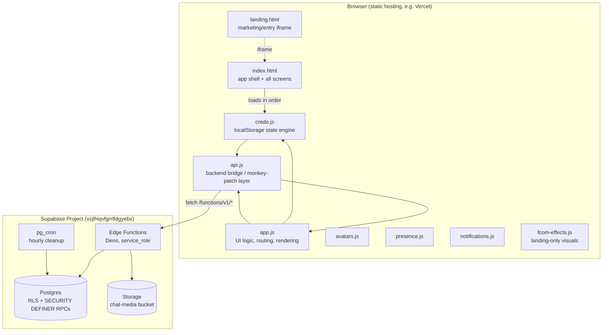
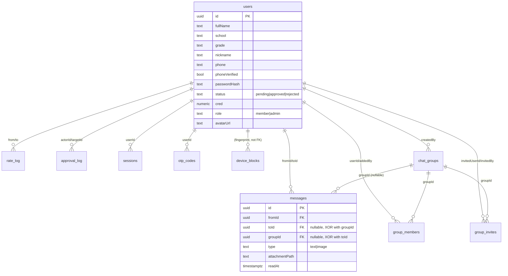
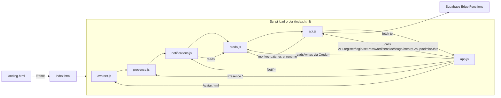
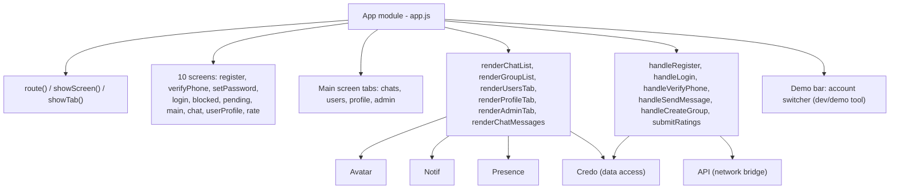
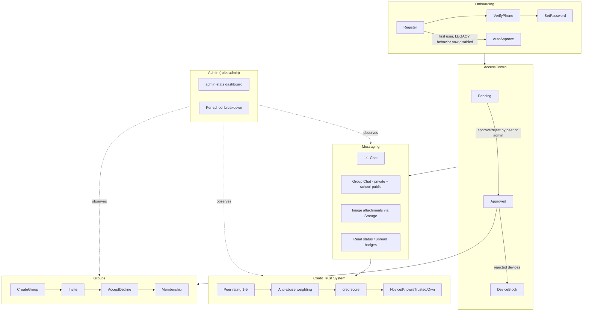

I now have a complete picture of the codebase, its live Supabase backend, and where documentation diverges from reality. Here is the full analysis.

---

# Fcom — Codebase & Architecture Report

## 0. Important framing note

The prompt frames me as reviewing an **iOS** codebase, but this repository is a **vanilla HTML/CSS/JavaScript web app** (static SPA-in-an-iframe) with a **Supabase** backend — there is no Swift, Xcode project, or mobile shell anywhere in the repo. I'm reporting on what actually exists rather than guessing at an iOS layer. If an iOS client is planned separately, let me know and I'll scope a follow-up analysis once that code exists.

---

## 1. Architecture Overview

**Type:** Static, no-build, vanilla-JS single-page app + Supabase serverless backend. No React/Vue/Angular, no bundler, no `package.json`, no TypeScript on the frontend.



**Key architectural decision (must be preserved):** `app.js` never talks to the network directly. It only calls `Credo.*` (sync, localStorage) methods. `api.js` loads *between* `credo.js` and `app.js` and **monkey-patches** `Credo.approveUser`, `Credo.rejectUser`, `Credo.rateUser`, `Credo.sendMessage` in place, so every write updates localStorage synchronously (UI stays instant/optimistic) and fires a backend call as a side effect. Reads are refreshed by periodically pulling server state back into the same localStorage keys (`syncNow()` / `_syncFromServer()`, polled every 2s plus a `fcom:server-sync` custom event).

This "localStorage-first, server-shadow" pattern is the single most important thing to understand before writing any feature — see §5.

**Module pattern:** every JS file is an IIFE revealing-module singleton (`const X = (() => { ...; return {...}; })();`) attached to `window` implicitly via `const`. No classes, no ES modules, no imports/exports on the frontend. Load order in `index.html` is significant and hard-coded:

```
avatars.js → presence.js → notifications.js → credo.js → api.js → app.js
```

---

## 2. Folder Structure

```
Fcom-app/
├── index.html            # App shell: all screens as hidden <section>s, single page
├── landing.html           # Marketing page, loaded into an <iframe id="landing-frame">
├── style.css              # App design system (~1950 lines)
├── credo.js               # localStorage domain/state engine ("Credo" trust system)
├── api.js                 # Supabase bridge + Credo monkey-patches + live sync
├── app.js                 # All UI logic/rendering/routing (~2100 lines, one big module)
├── avatars.js             # Deterministic gradient-avatar generator
├── presence.js             # Online/typing indicators via localStorage + storage events
├── notifications.js        # Unread counts + toast notifications
├── fcom-effects.js         # Landing page particle/cursor-glow effects
├── .env.example            # Documents required Edge Function secrets
├── migrations/              # 001–021 numbered SQL files (legacy tracking location)
├── supabase/
│   ├── config.toml
│   ├── seed.sql             # Dev/staging seed data — never run in prod
│   ├── migrations/           # Timestamped CLI migrations (020–025) — the real source of truth
│   └── functions/            # Deno Edge Functions, one per endpoint
│       ├── _shared/           # db.ts, jwt.ts, bcrypt.ts, ratelimit.ts, response.ts, groups.ts, school.ts
│       ├── register/ verify-phone/ resend-otp/ set-password/ login/ logout/
│       ├── approve/ reject/ rate/ messages/ users/ me/
│       ├── groups/ upload-media/ admin-stats/ cleanup/
├── tests/postman/            # Postman collection + environment (manual/CI-less testing)
├── BACKEND.md / DEPLOY.md / TESTING.md   # Documentation (see drift warnings below)
├── docs/export-web-api-supabase.txt      # Ad-hoc export, not linked from other docs
└── .tmp_fcom/                 # Stray prototype HTML files, not referenced anywhere
```

There is **no `src/`, no build step, no bundler config, no `package.json`** for the frontend. Deployment is a static file copy (`.vercelignore` present → Vercel static hosting).

---

## 3. Design System Summary

No Figma file is referenced anywhere in the codebase, README, or docs, and there's no `figma.com` URL to resolve — the design system exists purely as CSS. (I checked; there's nothing for the Figma MCP to pull from here. If your team has a Figma file for Fcom, share the link and I'll cross-check it against `style.css` in a follow-up pass.)

**Token system** — defined in `style.css :root` (dark theme only, no light mode):

| Category | Tokens |
|---|---|
| Backgrounds | `--bg`, `--bg-soft`, `--surface`, `--surface-strong`, `--surface-soft` (all glassmorphic rgba white overlays) |
| Text | `--text`, `--muted`, `--muted-soft` |
| Accent colors | `--blue`, `--blue-strong`, `--cyan`, `--violet`, `--gold`, `--danger`, `--success` |
| Credo-level colors | `--cred-novice`, `--cred-known`, `--cred-trusted`, `--cred-own` (drives `.novice/.known/.trusted/.own` badge classes) |
| Radii | `--radius-xl/lg/md/sm/xs` (30/24/18/14/10px) |
| Shadows | `--shadow-lg/md/sm` |
| Fonts | `--font-display` ("Clash Display"), `--font-body` ("Satoshi"), `--font-mono` |

**Visual language:** dark, glassmorphic, gradient-noise backgrounds, floating radial-gradient "ambient lights", SVG-noise overlay, particle canvas on the landing page. Buttons use `.btn` + modifier classes (`.btn-primary`, `.btn-outline`, `.btn-danger`, `.btn-accent`, `.btn-success`, `.btn-small`, `.btn-block`).

**Drift risk:** `landing.html` defines its **own separate, slightly different** `:root` token set inline in a `<style>` block (different variable names, e.g. `--purple` instead of `--violet`, no `--cred-*` tokens, different shadow scale) instead of importing `style.css`. The two token systems are visually similar but not literally shared — a change to one will silently not propagate to the other.

---

## 4. Existing UI Components That Should Be Reused

All components are CSS-class + vanilla-JS render-function pairs (no component framework), driven from `app.js`. Reuse these rather than inventing new patterns:

| Component | Where implemented | Notes |
|---|---|---|
| `Avatar.html({seed, imageUrl, chars, extraClass})` | `avatars.js` | Deterministic gradient avatar from any seed string; falls back from photo → initials on image error. Used everywhere (chat list, profile, groups). |
| `.card` / `.card-list` | `style.css` + render functions in `app.js` | Generic list-row pattern used for chats, members, pending requests, admin lists. |
| `.glass-panel` | `style.css` | The base "frosted card" surface used for every panel/modal-like block. |
| `.cred-badge`, `.level-badge`, `.cred-bar` | `style.css` + `Credo.getCredLevel/getCredProgress` | Trust-level visualization (Novice/Known/Trusted/Own), colored via `--cred-*` tokens. |
| `Notif.showToast({type, text, actionLabel, onAction})` | `notifications.js` | Toast system for approvals/messages; 3 built-in SVG icon types. |
| `Presence` badges (online dot / "печатает…") | `presence.js` + `_updatePresenceList()` in `app.js` | Cross-tab presence via localStorage `storage` events, polled every 1.5s. |
| `.demo-select-*` custom dropdown | `app.js` `_renderDemoMenu` | Accessible custom `<select>` replacement (native select kept for a11y fallback) — reuse this pattern instead of native `<select>` for any new picker UI. |
| `_searchEmptyHTML(query)` | `app.js` | Standard "nothing found" empty-state block. |
| `escapeHtml`, `truncate`, `formatDate`, `formatTime` | `app.js` | The only sanctioned string-escaping helpers — **all** interpolated HTML in `app.js` goes through `escapeHtml()`. Any new feature must do the same (no framework auto-escaping exists here — raw `innerHTML` templates are used throughout).

---

## 5. Existing Supabase Structure

### 5.1 Live project
- Project ref `vzjlhiqvfgrrlfdgyebx` (ap-southeast-2, Postgres 17.6, `ACTIVE_HEALTHY`) — this is the one `api.js` points to. A second project (`pdedrrqddswvkssrknph`, named "JWT_SECRET") exists but is `INACTIVE` — likely an abandoned experiment, not in use.

### 5.2 Tables (verified live, not just from migration files)

| Table | RLS | Rows | Purpose |
|---|---|---|---|
| `users` | ✅ enabled, 3 policies | 18 | Core identity: `id, fullName, school, grade, nickname, phone, phoneVerified, passwordHash, status, cred, createdAt, avatarUrl, role` |
| `otp_codes` | ✅ enabled, **0 policies** (= fully blocked) | 0 | Phone verification codes |
| `sessions` | ✅ enabled, **0 policies** (= fully blocked) | 0 | JWT `jti` revocation store |
| `messages` | ✅ enabled, 1 policy | 11 | Direct + group chat messages (unified table, `groupId` nullable) |
| `rate_log` | ✅ enabled, 1 policy | 5 | Immutable Credo rating audit log |
| `device_blocks` | ✅ enabled, **0 policies** (= fully blocked) | 2 | Fingerprint blocklist after rejection |
| `rate_limit_log` | ✅ enabled, **0 policies** (= fully blocked) | 0 | Persistent rate limiter |
| `approval_log` | ✅ enabled, 1 policy | 16 | Approve/reject audit trail |
| `chat_groups` | 🔴 **disabled** | 12 | Private + per-school public groups |
| `group_members` | 🔴 **disabled** | 39 | Group membership/roles |
| `group_invites` | 🔴 **disabled** | 2 | Invite-only join flow |
| `users_safe` (view) | — | — | Safe projection of `users` for future direct API use |

### 5.3 Database relationship overview



### 5.4 Business-logic functions/RPCs (all `SECURITY DEFINER`, called from Edge Functions)
`apply_cred_delta`, `approve_and_log`, `reject_and_log`, `rate_and_apply`, `auto_approve_first` (now a no-op, see §7), `had_conversation`, `get_times_rated`, `get_daily_cred_change`, `get_unread_counts`, `conversation_summary`, `mark_messages_read`, `guard_cred_and_status` (trigger), `enforce_rate_cooldown` (trigger), `log_status_change` (trigger), `cleanup_expired_sessions/otp/rate_limit_log`.

### 5.5 Edge Functions (Deno, all under `supabase/functions/`)
`register`, `verify-phone`, `resend-otp`, `set-password`, `login`, `logout`, `me`, `approve`, `reject`, `rate`, `messages`, `users`, `groups`, `upload-media`, `admin-stats`, `cleanup`. Shared helpers in `_shared/`: `db.ts` (service_role client), `jwt.ts` (custom HS256), `bcrypt.ts` (actually PBKDF2-SHA256), `ratelimit.ts`, `response.ts`, `groups.ts`, `school.ts`.

**Auth model:** custom HS256 JWT, *not* Supabase Auth. `auth.uid()` is always `NULL` for these requests, so classic RLS policies referencing `auth.uid()` are decorative for this app's own traffic — real protection comes from `service_role`-only writes plus explicit `REVOKE` grants (see §7 for where that pattern was **not** applied).

---

## 6. Things That Must Never Be Changed

From the project's own documentation (`BACKEND.md`) plus what I verified in code/live DB:

- **Frozen field names** (used identically across `credo.js`, `app.js`, DB columns, JWT payload): `id, fullName, school, grade, nickname, phone, phoneVerified, passwordHash, status, cred, createdAt, role, avatarUrl`. Renaming any of these breaks the sync layer silently.
- **`index.html` element IDs**: screen IDs (`#screen-*`), field IDs (`#reg-fullname`, `#login-nickname`, …), button IDs (`#login-btn`, `#rate-submit-btn`, …) — `app.js` binds to these by exact string in `init()` and `showScreen()`. No IDs may be renamed without updating every reference in `app.js`.
- **Script load order** in `index.html`: `avatars → presence → notifications → credo → api → app`. `api.js` relies on patching `Credo` *before* `app.js`'s `DOMContentLoaded` handler runs.
- **`api.js`'s monkey-patch contract**: `Credo.approveUser/rejectUser/rateUser/sendMessage` must remain synchronous from `app.js`'s point of view (local write first, network side-effect second). Introducing an `await` in front of these call sites in `app.js` would break the optimistic-UI pattern everywhere.
- **Error code strings**: `app.js`'s `REGISTER_ERRORS` / `LOGIN_ERRORS` / `VERIFY_ERRORS` lookup objects match Edge Function error codes verbatim (e.g. `nickname_taken`, `account_not_approved`). Changing an Edge Function's error string without updating the matching map produces a silent fallback/blank message.
- **`cred` and `status` columns on `users`**: protected at the DB level by the `guard_cred_and_status` trigger — direct `UPDATE users SET cred=…` or `SET status=…` will throw `insufficient_privilege` unless run inside `apply_cred_delta` / `approve_and_log` / `reject_and_log` / `rate_and_apply`, which set `app.allow_direct_write` for the duration of the transaction. **Any new feature that changes cred or approval status must add a new sanctioned RPC**, not a raw `UPDATE`.
- **`service_role` key**: must never appear in any frontend file (`api.js`, `index.html`, etc.) — enforced by convention/checklist today, not by tooling.
- **`supabase/seed.sql`**: must never be run against the production project (truncates user data).

⚠️ **Verify before trusting, don't just take the docs' word for it:** `BACKEND.md`/`DEPLOY.md` explicitly state *"`credo.js` — entire file — never modified"*. Git history shows this is **not actually true** — `credo.js` has been edited in at least two commits after the initial publish (one added 156 lines). This doesn't mean the rule is wrong going forward, but it means the documentation is aspirational rather than descriptive, and I'd confirm current intent with you before assuming any file is truly frozen.

---

## 7. Risks You Should Know Before Implementing Features

### 🔴 Critical — live, exploitable, right now
**`chat_groups`, `group_members`, `group_invites` have Row Level Security disabled in production**, and — I checked the actual grants, not just the RLS flag — `anon` and `authenticated` roles hold full `SELECT/INSERT/UPDATE/DELETE` on all three tables. This means anyone holding the public anon key (which is meant to be safe to embed, and is effectively public once shipped in the frontend) can, right now, via plain PostgREST calls (`/rest/v1/chat_groups`, etc.) **read every group/membership/invite and insert, modify, or delete rows directly**, completely bypassing the `groups` Edge Function's authorization logic (school isolation, invite-only checks, admin-only actions). This directly contradicts the project's own documented security model ("all INSERT/UPDATE/DELETE is REVOKED from anon/authenticated; every write must go through an Edge Function"), which *was* correctly applied to every table through migration `019_security_hardening.sql` but was **not** re-applied when migration `024_groups_and_media.sql` added these three tables. I'm not fixing this myself per your instructions, but you should treat this as a priority to raise with the lead developer — it needs a `REVOKE` + RLS-policy pass mirroring `019`, or at minimum RLS policies matching the `messages`/`rate_log` pattern.

### 🟠 Documentation vs. live system drift
- `DEPLOY.md`'s migration list stops at `019`; `list_migrations` on the live project shows only through `021`. But migrations `022`–`025` exist as **files** in `supabase/migrations/` and their effects are clearly live (the `role` column exists, group tables have data, `auto_approve_first` is a no-op). This means those four migrations were applied out-of-band (SQL editor / manual push) without being recorded in Supabase's migration-tracking table — future `supabase db push` runs could behave unexpectedly, and there's no single source of truth for "what's actually deployed."
- **`auto_approve_first` is now a no-op** (migration `023`). BACKEND.md still documents "First user in a school is auto-approved" as current behavior — it is not; every new registrant now requires manual approval by an existing approved (or admin) user regardless of school size.
- BACKEND.md states **"There is currently no admin role separate from `approved` users"** — this is stale. A `role` column (`member`/`admin`) exists on `users` (migration `022`) and is actively used in `app.js` (`_isAdmin()`) to gate an entire Admin tab, multi-device login, and admin-stats.
- None of the Groups/Media/Admin-stats functionality (`groups`, `upload-media`, `admin-stats` Edge Functions, `chat_groups`/`group_members`/`group_invites`/Storage) is documented in `BACKEND.md` or `DEPLOY.md` at all — treat those docs as covering roughly the first ~70% of the system's current feature set.

### 🟡 Architectural / engineering risks
- **Everything in `app.js` is one 2,100-line IIFE.** There's no module boundary between routing, rendering, and event wiring — any new screen/feature needs to slot into the existing `screens{}` map, `showScreen()`/`route()` state machine, and the giant `init()` event-wiring function at the bottom. Expect merge-conflict risk if multiple features touch `app.js` concurrently.
- **No test runner, no CI.** `tests/postman/` is a manual Postman collection; `TESTING.md` is a written test plan for humans to execute by hand. There is no automated regression safety net — any backend change is only as safe as someone manually re-running the Postman collection.
- **No build step / bundler / TypeScript on the frontend.** All frontend code ships as-is; there's no linting pipeline referenced either (no `.eslintrc`, no `package.json`). Style consistency relies entirely on convention.
- **`localStorage` as the client source of truth**, refreshed by polling every 2s plus a custom sync event. New features that add data must decide whether they belong in this sync loop (`_syncFromServer`/`_syncGroupsFromServer` in `api.js`) or they will silently only exist in one browser tab.
- **Two independent design-token systems** (`style.css` vs. inline `<style>` in `landing.html`) — a rebrand or token change in one won't automatically apply to the other.
- **Informal git history** (commit messages like "888", "777", "66") suggests rapid, low-process solo/small-team iteration — expect the working tree to be ahead of what's written down, confirm assumptions directly with the lead developer rather than trusting comments/docs at face value.
- **Dev-mode OTP bypass (`000000`) and `_devOtp` in API responses** are gated on `SMS_API_URL` being unset — worth double-checking this env var is actually set in the production Supabase project before assuming OTP is enforced for real users.

---

## 8. Coding & Project Conventions

- **Module pattern**: `const X = (() => { …private…; return {…public…}; })();` everywhere — no ES `import`/`export`, no bundler.
- **Naming**: `camelCase` for functions/variables, `_camelCase` prefix for "private" (module-internal, not exported) functions, `PascalCase` only for the module singletons themselves (`Credo`, `API`, `App`, `Avatar`, `Presence`, `Notif`).
- **Comments/docs**: File-header JSDoc-style comments in **Russian**, explaining purpose and localStorage key layout; inline comments also mostly Russian. All **user-facing strings are Russian**; error *codes* are English snake_case constants mapped to Russian display text in lookup tables inside `app.js`.
- **HTML templating**: raw template literals + `.innerHTML`, always passed through the local `escapeHtml()` helper for interpolated user data — there is no auto-escaping framework, so this must be done manually and consistently for any new render function.
- **DB naming**: PostgreSQL tables/columns use `camelCase` in double quotes (`"fullName"`, `"createdAt"`, `"groupId"`) rather than the more common Postgres `snake_case` — this is a deliberate choice to keep frontend/DB field names identical; keep following it.
- **Migrations**: two parallel numbering efforts exist — `migrations/NNN_verb_subject.sql` (legacy, docs reference this) and `supabase/migrations/<timestamp>_NNN_verb_subject.sql` (the CLI-tracked, actually-current one). New migrations should go in `supabase/migrations/` using `supabase migration new <name>` so they get proper CLI timestamp tracking — the plain `migrations/` folder appears to have been abandoned after `021`.
- **API response shape**: uniform `{ ok: true, ... }` / `{ ok: false, error: "snake_case_code" }` from every Edge Function via `_shared/response.ts` helpers (`ok()`, `err()`, `corsPrelight()`) — any new endpoint should use these, not ad-hoc `Response.json`.
- **Security pattern for new tables**: enable RLS + add explicit `REVOKE` from `anon`/`authenticated` + route all writes through `service_role` Edge Functions + (if the table holds a protected field like `cred`/`status`) add a guard trigger — this is the established pattern from migration `019`, but as noted in §7 it was **not** followed for the `chat_groups`/`group_members`/`group_invites` tables added in `024`.

---

## 9. Dependency Map



No third-party JS libraries/CDNs are used — everything is hand-rolled (no jQuery, no icon library import despite SVGs being hand-authored, no date library, no HTTP client beyond `fetch`).

---

## 10. Component Map



---

## 11. High-Level Feature Map



---

## How the major modules interact (summary)

1. **Boot**: `index.html` loads scripts in fixed order; `api.js`'s `_init()` runs on `DOMContentLoaded` *before* `app.js`'s own `init()` (both listen to the same event, but `api.js` is registered first), patching `Credo`'s write methods and kicking off a background sync if a session token exists.
2. **Read path**: `app.js` never fetches — it only reads `Credo.getUsers()/getChatMessages()/...`, which are pure `localStorage` reads. Freshness comes from `api.js` periodically overwriting those same localStorage keys from the server (`syncNow()` every 2s, plus an immediate sync after any write) and firing a `fcom:server-sync` event that `app.js` listens for to re-render (`handleServerSync`).
3. **Write path**: `app.js` calls `Credo.rateUser(...)` (etc.) exactly as it would in pure-local demo mode. Because `api.js` replaced that function at runtime, the call transparently (a) updates localStorage synchronously so the UI updates instantly, and (b) fires the matching Supabase Edge Function call in the background, rolling back the optimistic local write if the server rejects it.
4. **Backend**: Edge Functions are the only thing allowed to use the `service_role` key; they validate the custom JWT, enforce business rules (same-school, approved-only, cooldowns, rate limits), and call `SECURITY DEFINER` RPCs for any write that touches a guarded column (`cred`, `status`).
5. **Admin/Groups/Media** are newer subsystems layered on top of the same request/response contract but are under-documented and — for the group tables specifically — under-secured at the database layer (§7).

---

I have **not modified, committed, deployed, or executed any database changes** — this was a read-only inspection using the filesystem, git history, and the Supabase MCP (`list_projects`, `list_tables`, `list_migrations`, `get_advisors`, and read-only `execute_sql` `SELECT`s against `information_schema`/`pg_catalog`). No Figma file was found to inspect; if one exists, send me the link and I'll reconcile it against `style.css`.

Let me know which area you'd like to dig into next, or if you want me to draft (not yet implement) a remediation plan for the `chat_groups`/`group_members`/`group_invites` RLS gap for the lead developer to review.

I've found a critical discrepancy: credo.js was actually modified multiple times after its initial commit, with 159 lines added in commit 9d3de76, which directly contradicts the documented rule in BACKEND.md and DEPLOY.md stating it should never be touched. This is a significant finding about stale documentation that the lead developer needs to verify before I proceed with recommendations.